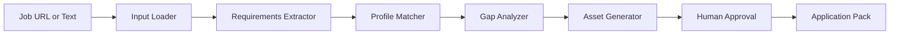

# Forward-Deployed GenAI Workflow Agent

This project is a LangGraph-based agentic workflow that converts a job posting into an Application Intelligence Pack.

## Features

- Job posting extraction from text or URL
- Structured requirement extraction
- Candidate profile matching
- Gap analysis
- Tailored CV bullet generation
- Recruiter outreach generation
- Interview preparation generation
- Human approval checkpoint
- LangSmith tracing
- Pytest test suite

## Architecture



## Setup

```bash
python3 -m venv .venv
source .venv/bin/activate
pip install -e ".[dev]"
cp .env.example .env
```

Add your API keys to `.env`.

## Run

```bash
app-agent --text-file examples/sample_job.txt
```

## Test

```bash
pytest -v
```

## Security Notes

- Do not commit `.env`.
- Do not include confidential employer data.
- Use synthetic or public job postings only.
- Review outputs manually before use.
